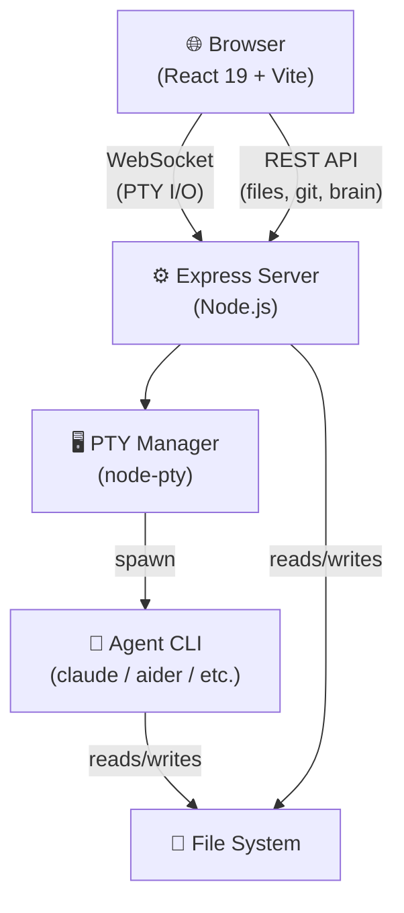
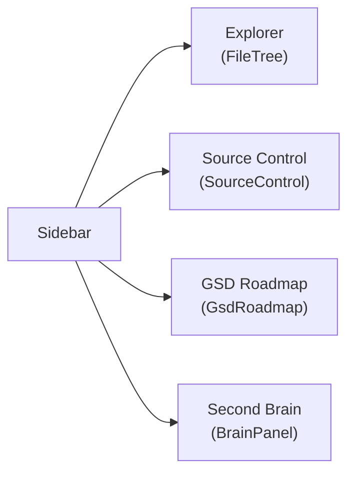

## System Architecture

SlopMop is a browser-based developer shell that wraps AI agent CLIs in a rich IDE-like interface.

The three main layers are the **client** (React + Vite), the **server** (Express + node-pty), and the **agent process** (any CLI like `claude`, `aider`, etc.).

## Key Subsystems

### Terminal / PTY
- `node-pty` spawns the agent in a real PTY so interactive CLI features work (colours, keyboard protocol, etc.)
- The WebSocket bridge in `ws-handler.ts` streams raw terminal data bidirectionally
- `xterm.js` in the browser renders the terminal with full VT100 support

### Editor Panel
- File tabs managed by `useEditorTabs` hook — supports file, diff, and brain tab types
- Server-side Shiki provides syntax highlighting so no large browser bundle is needed
- Preview tabs (italic) auto-replace each other; full tabs persist

### Sidebar Panels

### Audio Pipeline
- STT: Whisper (local binary, optional)
- TTS: Piper (local binary, optional)
- Push-to-talk via configurable keyboard combo
