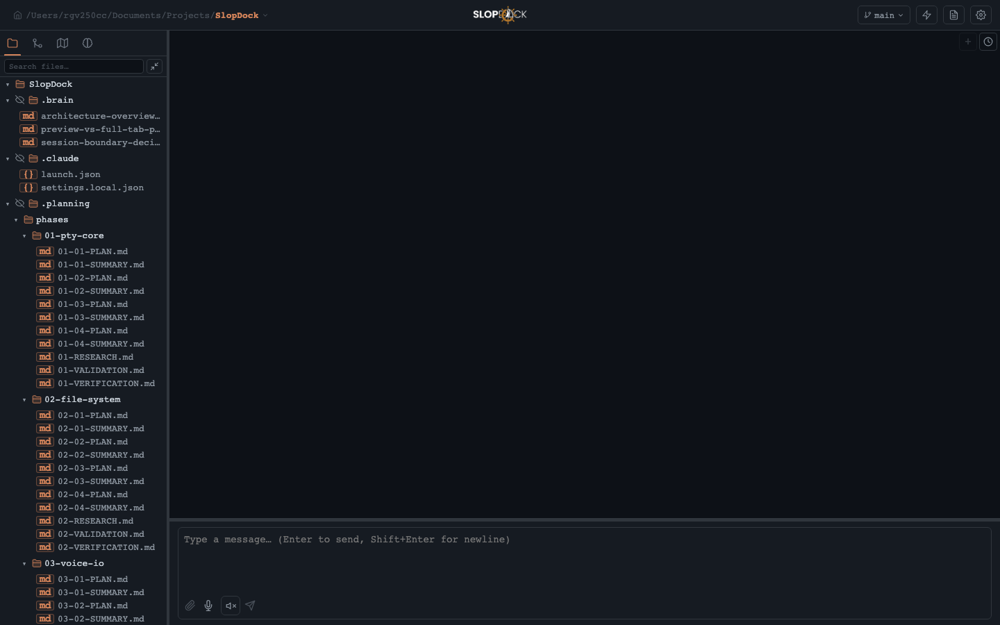
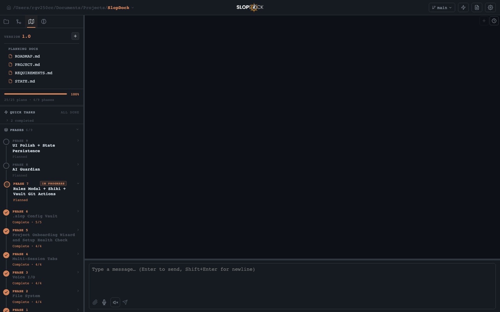
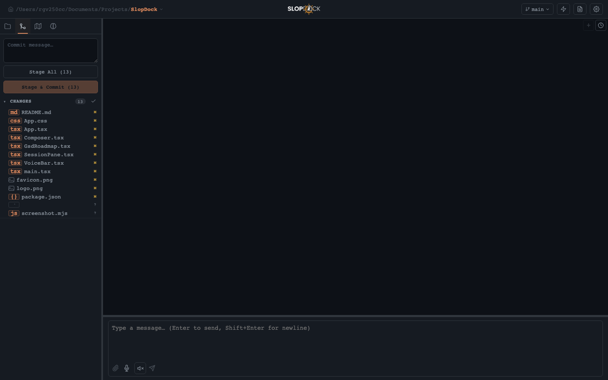
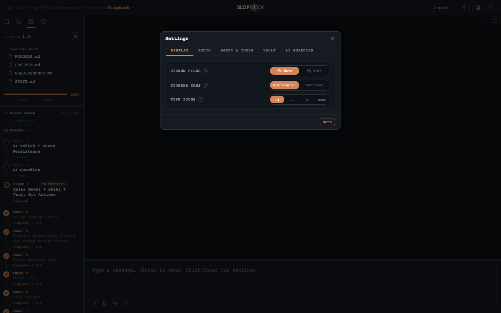

<div align="center">

# SlopDock

**A local browser workspace for AI-assisted development.**

[](LICENSE)
[](https://nodejs.org)
[](https://www.typescriptlang.org)
[](https://react.dev)

SlopDock wraps any AI coding CLI — Claude Code, Aider, Goose, OpenCode — in a unified browser UI
with a real PTY terminal, a VSCode-style file explorer, full git integration, local voice I/O, and
live GSD roadmap tracking. Everything runs locally. No cloud, no telemetry.

</div>

---

## Screenshots

| Explorer | GSD Roadmap |
|---|---|
|  |  |

| Source Control | Settings |
|---|---|
|  |  |

---

## What it does

Most AI coding workflows today jump between at least four windows: a terminal running the agent, a code editor, a git GUI, and a browser for docs. SlopDock collapses that into one.

The terminal is real — full PTY fidelity, ANSI color, interactive prompts, all keyboard shortcuts. The file tree shows exactly what the agent is working with. The diff viewer lets you inspect and stage changes before committing. Voice mode lets you speak to the agent and hear it read responses back, hands-free.

If you use [GSD](https://github.com/gsd-build/gsd-2) for structured development, the roadmap panel renders your `.planning/` directory inline — phases, plans, progress bars, quick tasks — so you stay oriented without leaving the session.

---

## Features

- **Full PTY terminal** — real pseudo-terminal via node-pty. ANSI color, interactive prompts, resize, scroll, copy/paste all work.
- **File explorer** — collapsible tree, file search, hidden-file toggle, per-file type icons, inline new-file/new-folder actions.
- **Syntax-highlighted editor** — view and edit any file with Shiki (`one-dark-pro` theme). Preview tabs promote to permanent on first edit.
- **Git integration** — staged/unstaged diff viewer with per-file stage, unstage, and discard. Branch switcher and push support.
- **Voice input (STT)** — push-to-talk or toggle mode. Transcribed locally by [Whisper](https://github.com/openai/whisper). Configurable hotkey.
- **Voice output (TTS)** — Claude's terminal output read aloud sentence-by-sentence via local [Piper](https://github.com/rhasspy/piper). Stop or interrupt at any time.
- **GSD roadmap** — renders `.planning/ROADMAP.md` phases, plans, quick tasks, and progress inline. Remove phases and plans without leaving the app.
- **Config vault** — backs up and restores Claude, GSD, git, and SSH dotfiles on a configurable schedule. Supports git-backed remote sync.
- **Second Brain panel** — per-workspace knowledge base stored as frontmatter Markdown in `.brain/`.
- **Agent-agnostic** — any CLI agent can be configured in Settings. Detected automatically if it is in `PATH`.
- **Multi-session tabs** — multiple terminal sessions per workspace. Live status indicators (working / waiting / done).
- **Onboarding wizard** — guided first-run setup. Health check bar surfaces git, CLAUDE.md, agent CLI, and node_modules status.
- **Drag-resizable panels** — sidebar, terminal, and preview widths are all adjustable and persisted per workspace.

---

## Requirements

- **Node.js 20+** — the backend PTY server requires at least Node 20 LTS
- **macOS** — primary platform; Linux likely works, Windows is not supported
- **Claude Code** (or another agent CLI) in `PATH` — `claude`, `aider`, `opencode`, `goose`, etc.
- **Optional: [Piper TTS](https://github.com/rhasspy/piper)** — enables voice output
- **Optional: [Whisper](https://github.com/openai/whisper)** — enables voice input (`pip install openai-whisper`)

---

## Quick start

**One-liner** — clones the repo, checks dependencies, and starts the dev server:

```bash
curl -fsSL https://raw.githubusercontent.com/rg1989/SlopDock/main/scripts/install.sh | bash
```

**Manual install** from a cloned repo:

```bash
npm install
npm run setup    # verifies Node, Claude CLI, GSD; installs what's missing
npm run dev
```

Open [http://localhost:5173](http://localhost:5173), pick a workspace folder, and start a session.

`npm run setup` is idempotent — safe to re-run. It never downgrades or resets an existing install.

---

## Project structure

```
slopdock/
├── client/                   # React 19 + Vite frontend
│   ├── components/           # All UI components
│   ├── hooks/                # Custom React hooks
│   ├── App.tsx               # Root layout and wiring
│   └── theme.css             # Single-source color palette
├── server/                   # Express + node-pty backend
│   ├── index.ts              # HTTP API endpoints (~40 routes)
│   ├── ws-handler.ts         # WebSocket PTY handler
│   ├── gsd.ts                # GSD roadmap parser (pure functions)
│   ├── file-api.ts           # File tree + git helpers
│   ├── piper-tts.ts          # Local Piper TTS integration
│   └── whisper-stt.ts        # Local Whisper STT integration
├── shared/
│   └── protocol.ts           # WebSocket message types
├── tests/                    # Vitest unit tests
├── docs/
│   ├── adr/                  # Architecture Decision Records
│   └── screenshots/          # App screenshots for documentation
└── scripts/
    ├── setup.sh              # Idempotent dependency check + install
    └── install.sh            # One-liner bootstrap for new installs
```

---

## Scripts

| Command | What it does |
|---|---|
| `npm run setup` | Check and install dependencies (Node, Claude CLI, GSD, voice tools) |
| `npm run dev` | Start Express server + Vite dev server concurrently |
| `npm run build` | TypeScript compile + Vite production build |
| `npm test` | Run unit tests with Vitest |
| `npm run update-vendor` | Pull latest `gsd-pi` from npm and refresh `vendor/` |

---

## Configuration

Settings are accessible via the gear icon in the top-right corner.

### Display
| Setting | Options |
|---|---|
| Hidden files | Show / Hide |
| Sidebar tabs | Horizontal / Vertical |
| Type icon size | 14 / 11 / 9 / None |

### Audio
| Setting | Description |
|---|---|
| PTT key | Configurable keyboard shortcut for push-to-talk |
| Recording mode | Hold (while key held) / Toggle (one press on, one press off) |

### Agent & Tools
Configure which CLI agent to spawn. SlopDock auto-detects installed agents (`claude`, `opencode`, `aider`, `gemini`, `codex`, `hermes`, `goose`) and lists available ones in a dropdown.

Each agent entry has: a **command** (`claude`), optional **args** (`--dangerously-skip-permissions`), and a **label** shown in the UI.

### Vault
Backs up dotfiles to `~/.slop/backups/`:

| File | Backed up path |
|---|---|
| `~/.claude/settings.json` | Claude Code settings |
| `~/.claude/CLAUDE.md` | Global Claude instructions |
| `~/.claude/keybindings.json` | Key bindings |
| `~/.gitconfig` | Git config |
| `~/.ssh/config` | SSH config |

Auto-backup schedule: **Never / On launch / Hourly / Daily**. Vault data can also be synced to a private git remote for machine portability.

### AI Guardian
Per-project toggle that enables roadmap alignment rules from `.slop/ai-guardian.md` — surfaces unplanned work, phase-skip warnings, and prompts to capture knowledge back to the second brain.

---

## Architecture

SlopDock is a local web app with two processes connected through a WebSocket:

```
Browser (React + xterm.js)
  │
  │  HTTP  ──►  Express server  ──►  node-pty  ──►  Agent CLI (claude / aider / …)
  │
  └─ WS   ─────────────────────────────────────────► PTY stdin/stdout
```

**Key design decisions:**

- **Session boundary** — the PTY connection, open editor tabs, and staged attachments are all grouped into a single `useSession` hook. Session state is scoped and self-contained; workspace-level state (file tree, roadmap, source control) lives in `App`. See [ADR-0001](docs/adr/0001-session-boundary.md).

- **Agent configuration in settings** — the agent command and args live in user settings, not per-workspace config files. SlopDock is a personal tool; the same user rarely wants different agents in different repos. A workspace-level override can be added when the need arises. See [ADR-0002](docs/adr/0002-agent-config-in-settings.md).

- **Audio coordination** — TTS and STT are mutually exclusive. The `AudioCoordinator` hook owns both and enforces that they never overlap. TTS auto-pauses when recording starts; an active recording cancels TTS. See [ADR-0003](docs/adr/0003-audio-coordinator-pattern.md).

- **No CSS-in-JS, no component libraries** — plain CSS in `client/App.css` with a single-source color palette in `client/theme.css`. All palette values are CSS custom properties; raw hex values are banned from component code.

---

## Voice setup

Voice features are optional and disabled gracefully if dependencies are absent.

**Whisper STT** (voice input):
```bash
pip install openai-whisper
brew install ffmpeg   # required for audio conversion
```

**Piper TTS** (voice output):

Download a pre-built binary and a voice model from the [Piper releases page](https://github.com/rhasspy/piper/releases). Place the `piper` binary somewhere in `PATH` and set the voice model path in Settings → Audio.

SlopDock will report setup status in the voice bar at the bottom of the terminal area.

---

## GSD integration

If your workspace has a `.planning/` directory created by [GSD](https://github.com/gsd-build/gsd-2), the roadmap panel renders it live:

- **Progress bar** — overall milestone completion (plans done / total)
- **Phase list** — each phase with status, plan count, and inline expand
- **Quick tasks** — ad-hoc tasks from `STATE.md` with completion status
- **Planning docs** — direct links to `ROADMAP.md`, `PROJECT.md`, `REQUIREMENTS.md`, `STATE.md`
- **Inline removal** — delete phases or plans from the UI without opening a terminal

The GSD panel is read-only by default; writes go through the GSD CLI running in the terminal session.

---

## Contributing

See [docs/CONTRIBUTING.md](docs/CONTRIBUTING.md) for the full guide. The short version:

1. Fork and clone the repo
2. `npm install && npm run setup`
3. Create a feature branch
4. Make your changes with tests where appropriate (`npm test`)
5. Open a pull request

No large dependencies without discussion — the bundle is intentionally lean.

---

## License

[MIT](LICENSE) — Roman Grinevic
