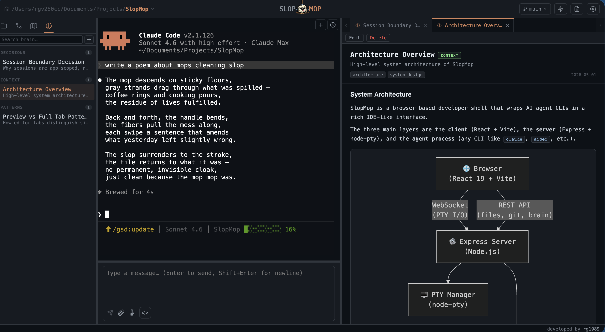
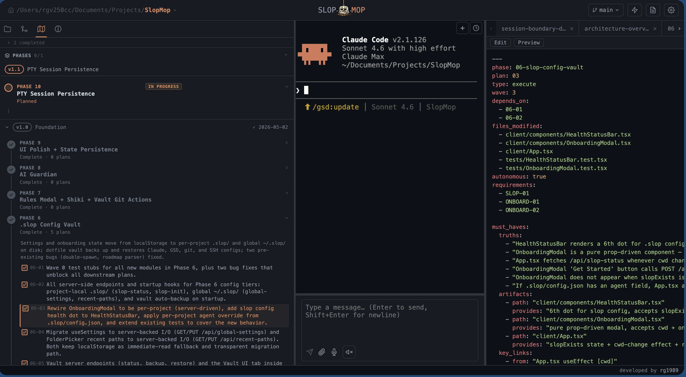
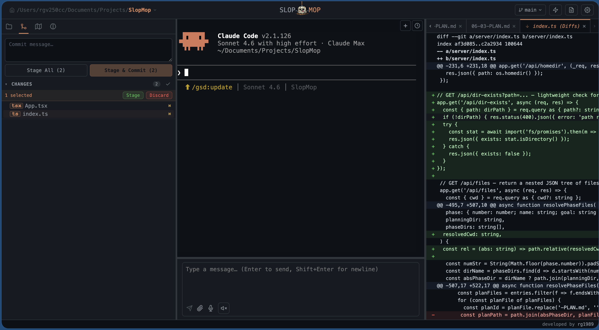
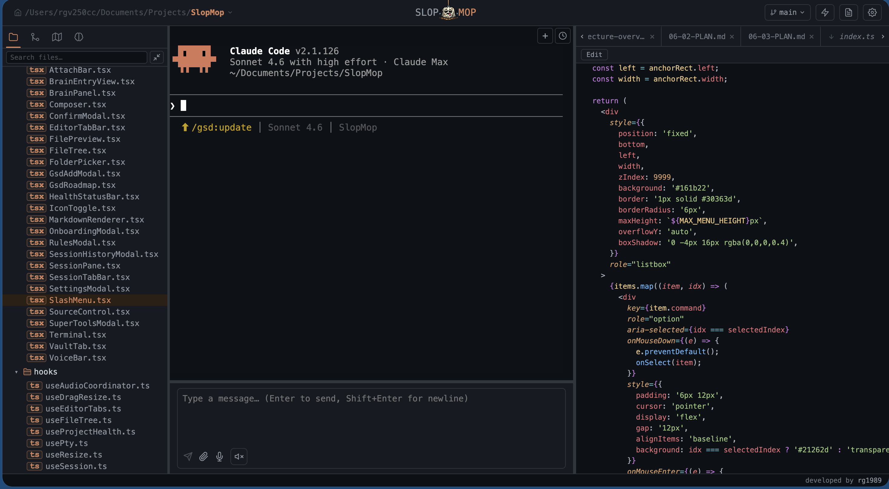
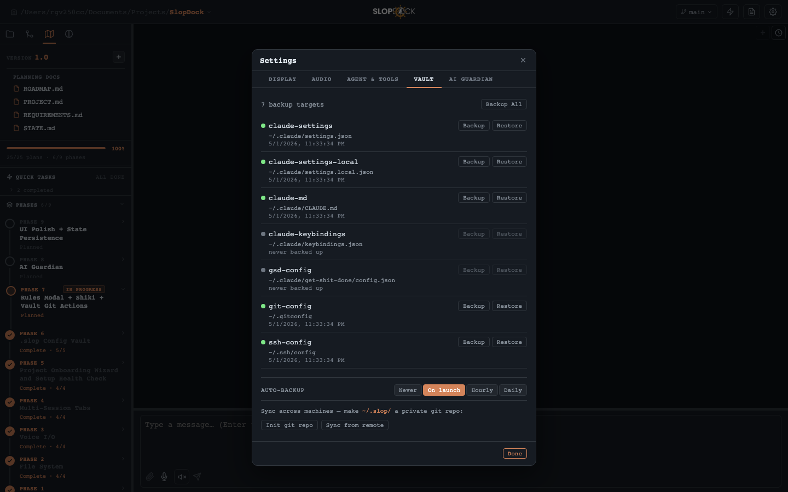
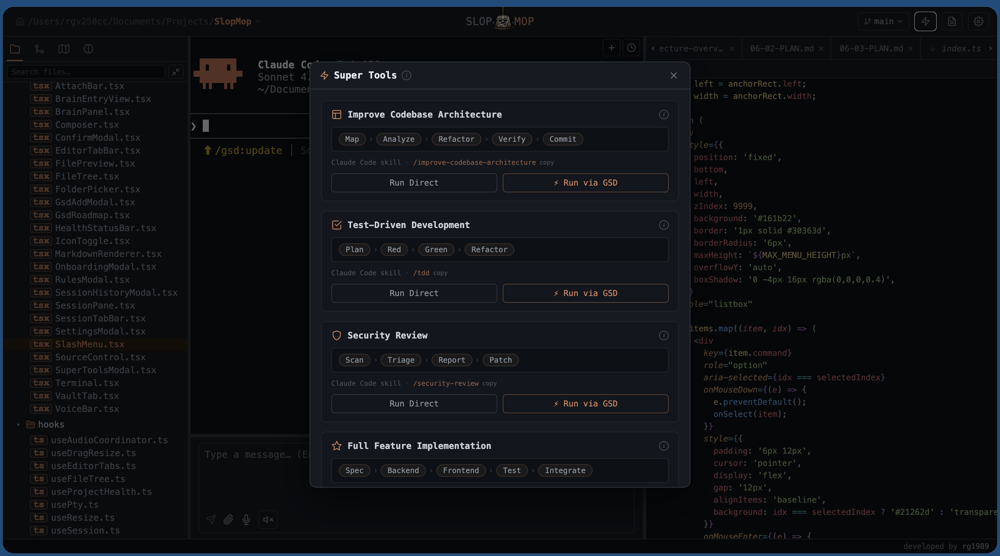

<div align="center">

# SlopMop

**The workspace the AI CLI tools forgot to build.**

[](LICENSE)
[](https://nodejs.org)
[](https://www.typescriptlang.org)
[](https://react.dev)

Open a browser. Select a folder. Start building.

*Yes, the name is intentional. AI generates slop. SlopMop is where you dock it, manage it, review it, and ship the parts that aren't.*

</div>

---

> I built this for myself. I looked for a tool that fit this exact gap and couldn't find one, so I made it. It solves my problem — every feature in here exists because I needed it. If it solves yours too, that's genuinely great. If you want to expand on it, fork it, or just steal the idea as a foundation for something better — all of that is good. If you find it useful, a star goes a long way. And whatever you build with it: don't get too sloppy.

---

---

## The gap nobody filled

Claude Code is excellent. So is Codex CLI, Aider, OpenCode, Gemini CLI. Every major lab now ships a terminal-based coding agent, and the intelligence behind them is genuinely impressive.

But they all ship the same thing: **a smart terminal and nothing else.**

They give you the engine. Nobody built the cockpit.

When you're actually working — not demoing, not running a single command, but doing a real multi-hour session across a real project — you need more than a blinking cursor. You need to see the file tree. You need to see what the agent changed before you commit it. You need to stay oriented to the plan. You need to capture the non-obvious decisions it made while it worked so you don't lose them. You need your git history accessible in two clicks, not buried in a second terminal window. You need to be able to speak a prompt and walk away from the keyboard.

None of the CLI tools give you any of that. They expect you to stitch it together yourself — another terminal for git, VS Code for files, a notes app for context, some external tool for planning. You end up with four applications open at once, none of them aware of the others, and the cognitive overhead of managing the environment starts eating into the work itself.

The heavy IDEs (Cursor, Windsurf) went the other direction: replace everything, enforce their own editor, make you adopt their opinions about what a workspace should look like. That works for some people. It doesn't work if you've already invested in your CLI setup, your Claude Code skills and slash commands, your GSD workflow, your personal CLAUDE.md. It doesn't work if you want to open a browser tab on a remote machine over VPN and just be there.

SlopMop is the thing in between: a **lightweight, browser-based workspace that wraps your CLI of choice** and gives it the environment it always should have had. The workspace knows what project you're in, keeps your plan visible, tracks what changed, handles your git operations, remembers your architectural decisions, and surfaces the tools you always forget to use — all without getting in the way or replacing anything you already rely on.

---

## What it looks like in practice

### Active session — Second Brain panel open



*The terminal runs Claude Code on the left. The Second Brain panel on the right surfaces per-project decisions and architectural notes — the context the agent needs, visible while it works, not buried in a separate app.*

---

### GSD Roadmap — live plan tracking



*The roadmap panel renders your `.planning/` directory inline. Phases, plan files, progress, quick tasks — always visible, without leaving the session. The right pane previews the active plan with full markdown rendering.*

---

### Source control — full diff before every commit



*Every changed file listed with per-file stage, unstage, and discard controls. The diff viewer shows exactly what the agent wrote. You review before you commit. This is the step the CLI tools skip.*

---

### File explorer and syntax-highlighted editor



*Collapsible tree, file type icons, fuzzy search. The editor opens any file with full syntax highlighting. Preview tabs promote to permanent on first edit — the VS Code pattern, inside the browser workspace.*

---

### Vault — dotfile backup and restore



*One-click backup and restore for Claude settings, GSD config, git config, and SSH config. Timestamped snapshots with optional git-backed remote sync. Switch machines without losing your setup.*

---

### Super Tools — skills you'd otherwise forget to invoke



*A curated, one-click palette of Claude Code skills: architecture review, test-driven development, security review, full-feature implementation. The power was always there — it just wasn't visible. Now it's a click away.*

---

## Why SlopMop specifically

### It's project-centric, not session-centric

Every other tool treats the terminal as the unit of organization. SlopMop treats the **project folder** as the unit. When you open a folder, you get a complete workspace scoped to that project: its own file tree, its own git state, its own roadmap, its own Second Brain, its own config and AI Guardian rules. Open four tabs for four projects — each one is self-contained, no confusion between them. This is how developers actually think about their work.

### It makes the invisible visible

A skilled developer working with Claude Code knows that `/ultrareview`, `/tdd`, `/full-feature`, and a dozen other skills exist — but in the middle of a session, under deadline pressure, they don't get invoked because they're not visible. SlopMop puts them in a launcher. The tools you already have become the tools you actually use.

### It keeps the plan in the room

If you use [GSD](https://github.com/gsd-build/gsd-2) — or any structured planning approach — the biggest risk is losing orientation. Which phase are we in? What's the acceptance criterion for this plan? What changed in the last session? SlopMop renders all of that inline, live, without you having to open a file or switch windows. The plan stays in the room the entire time.

### It closes the git loop

The AI agent writes code. You need to verify it, stage it, and commit it. Right now that means opening a git GUI or running commands in a separate terminal. SlopMop brings the full diff — staged, unstaged, color-coded, per-file — into the sidebar. Stage and commit without leaving your session. The loop closes in one place.

### It gives you your voice back

Push-to-talk or toggle mode. Speak your prompt, transcribed locally by Whisper. Claude's responses read back to you sentence-by-sentence by local Piper TTS. Hands-free while the agent works. No cloud routing, no API key for speech, no subscription beyond what you already have. This is something no CLI tool and no heavy IDE does correctly — and once you've worked this way for an hour, going back feels like a regression.

### It travels with you

Run SlopMop on a remote server — a powerful cloud machine, a workstation at the office, anything accessible over VPN. Open your browser on any device. Your entire development environment is there. No extensions to install, no sync to set up, no credentials on the thin client. The browser is your terminal.

### It's yours

SlopMop wraps your own Claude Code subscription. It has no telemetry, no cloud component, no account. All features except the agent CLI itself run fully offline. You are not a user of SlopMop's platform — you are running your own copy, with your own configuration, against your own projects. The `.slop/` directory in each project lets you define project-specific rules and AI Guardian instructions that guide the agent exactly the way you want for that codebase.

---

## Feature overview

### Terminal and sessions
- **Full PTY fidelity** — real pseudo-terminal via node-pty. ANSI color, interactive prompts, resize, scroll, and every keyboard shortcut work exactly as in a native terminal
- **Multiple sessions per workspace** — open separate agent tabs for separate contexts within the same project. Each gets its own PTY, editor tabs, and file attachments. Live status indicators show working / waiting / idle
- **Session persistence** — reload the browser and the session reconnects. The PTY keeps running in the background
- **Any CLI agent** — Claude Code, Aider, OpenCode, Goose, Gemini CLI, Codex, Hermes. Auto-detected from PATH; configure command and args in Settings

### File management
- **File explorer** — collapsible tree, per-type icons, fuzzy search, hidden-file toggle, inline new-file and new-folder
- **Syntax-highlighted editor** — view and edit any file via Shiki (`one-dark-pro` theme). Preview tabs promote to permanent on first edit
- **File sharing with the agent** — attach any file to the current session as context without typing a path

### Git
- **Staged / unstaged diff viewer** — full unified diff, color-coded, per-file
- **Per-file controls** — stage, unstage, or discard individual files
- **Branch switcher and push** — change branches and push without leaving the workspace
- **Commit from the sidebar** — write a message and commit staged changes directly

### Voice
- **Voice input** — push-to-talk or toggle. Transcribed locally by [Whisper](https://github.com/openai/whisper). Configurable hotkey. No cloud routing
- **Voice output** — responses read aloud sentence-by-sentence via local [Piper](https://github.com/rhasspy/piper). Pause or interrupt at any time
- **Hands-free design** — TTS pauses automatically when you start recording. No accidental overlap

### Planning and knowledge
- **GSD roadmap panel** — renders `.planning/ROADMAP.md` live: phases, plan files, progress bar, quick tasks, planning doc links. Remove phases and plans from the UI without touching a terminal
- **Second Brain panel** — per-workspace knowledge base in `.brain/`. Architectural decisions, pitfalls, and running context stay attached to the project, not lost in a notes app
- **AI Guardian** — per-project rules in `.slop/ai-guardian.md` that guide the agent to respect the roadmap, flag unplanned work, and surface knowledge capture after non-trivial sessions

### Skills and tooling
- **Super Tools launcher** — one-click palette for Claude Code skills that would otherwise require remembering a slash command: architecture review, TDD, security review, full-feature implementation, and more
- **Run Direct or Run via GSD** — choose the structured path or the fast path per invocation

### Workspace and portability
- **Project-scoped config** — each folder gets its own `.slop/` directory with `config.json` and `ai-guardian.md`. Different projects, different rules, automatically
- **Vault backup** — timestamped snapshots of `~/.claude/settings.json`, `CLAUDE.md`, `keybindings.json`, `~/.gitconfig`, and `~/.ssh/config`. Auto-schedule (on launch / hourly / daily) with optional git-backed remote sync
- **Drag-resizable panels** — sidebar, terminal, and preview widths are all adjustable and persisted per workspace
- **Health check bar** — surfaces missing git, CLAUDE.md, agent CLI, or node_modules on first open
- **Remote development via VPN** — run on a server, develop from a browser anywhere
- **Fully offline** — all features except the agent CLI run without internet
- **Extensible by design** — Express + React, ~40 HTTP routes, plain CSS. Adding a new panel or integration is a few files. The platform is intentionally lean and transparent so you can shape it to your workflow

---

## Quick start

**One-liner:**
```bash
curl -fsSL https://raw.githubusercontent.com/rg1989/SlopMop/main/scripts/install.sh | bash
```

**Manual:**
```bash
npm install
npm run setup    # verifies Node, Claude CLI, GSD; installs what's missing
npm run dev
```

Open [http://localhost:5173](http://localhost:5173), select a workspace folder, start a session.

`npm run setup` is idempotent — safe to re-run at any time.

---

## Requirements

| | |
|---|---|
| **Node.js 20+** | Backend PTY server |
| **macOS** | Primary platform; Linux likely works; Windows not supported |
| **Claude Code** (or another CLI agent) in `PATH` | `claude`, `aider`, `opencode`, `goose`, etc. |
| **[Piper TTS](https://github.com/rhasspy/piper)** *(optional)* | Voice output |
| **[Whisper](https://github.com/openai/whisper)** *(optional)* | Voice input (`pip install openai-whisper` + `brew install ffmpeg`) |

---

## Voice setup

Voice features are optional and degrade gracefully if dependencies are absent.

**Whisper STT:**
```bash
pip install openai-whisper
brew install ffmpeg
```

**Piper TTS:** download a pre-built binary and voice model from the [Piper releases page](https://github.com/rhasspy/piper/releases). Place the binary in `PATH` and set the model path in **Settings → Audio**.

SlopMop reports voice setup status in the bar at the bottom of the terminal area.

---

## GSD integration

If your workspace has a `.planning/` directory from [GSD](https://github.com/gsd-build/gsd-2), the roadmap panel renders it live with no configuration:

- **Progress bar** — milestone completion across all phases
- **Phase list** — each phase with status, plan count, and inline expand
- **Quick tasks** — ad-hoc tasks from `STATE.md` with completion tracking
- **Planning doc links** — direct access to `ROADMAP.md`, `PROJECT.md`, `REQUIREMENTS.md`, `STATE.md`
- **Inline removal** — delete phases or plans from the UI without opening a terminal

The GSD panel is read-only by design; writes go through the GSD CLI in the terminal session.

---

## Project structure

```
slopmop/
├── client/                   # React 19 + Vite frontend
│   ├── components/           # All UI components
│   ├── hooks/                # Custom React hooks
│   ├── App.tsx               # Root layout and wiring
│   └── theme.css             # Single-source color palette (CSS custom properties)
├── server/                   # Express + node-pty backend
│   ├── index.ts              # HTTP API endpoints (~40 routes)
│   ├── ws-handler.ts         # WebSocket PTY handler
│   ├── gsd.ts                # GSD roadmap parser (pure functions)
│   ├── file-api.ts           # File tree + git helpers
│   ├── piper-tts.ts          # Local Piper TTS integration
│   └── whisper-stt.ts        # Local Whisper STT integration
├── shared/
│   └── protocol.ts           # WebSocket message types
├── tests/                    # Vitest unit tests
├── docs/
│   ├── adr/                  # Architecture Decision Records
│   └── screenshots/          # App screenshots
└── scripts/
    ├── setup.sh              # Idempotent dependency checker
    └── install.sh            # One-liner bootstrap
```

---

## Scripts

| Command | What it does |
|---|---|
| `npm run setup` | Check and install dependencies (Node, Claude CLI, GSD, voice tools) |
| `npm run dev` | Start Express server + Vite dev server concurrently |
| `npm run build` | TypeScript compile + Vite production build |
| `npm test` | Run unit tests with Vitest |
| `npm run update-vendor` | Pull latest `gsd-pi` from npm and refresh `vendor/` |

---

## Configuration

### Display
| Setting | Options |
|---|---|
| Hidden files | Show / Hide |
| Sidebar tabs | Horizontal / Vertical |
| Type icon size | 14 / 11 / 9 / None |

### Audio
| Setting | Description |
|---|---|
| PTT key | Configurable push-to-talk hotkey |
| Recording mode | Hold (while key held) / Toggle (press on, press off) |

### Agent & Tools
Configure which CLI agent to spawn. SlopMop auto-detects installed agents (`claude`, `opencode`, `aider`, `gemini`, `codex`, `hermes`, `goose`). Each entry has a **command**, optional **args**, and a **label**.

### Vault
Backs up dotfiles to `~/.slop/backups/` on a configurable schedule. Optional git remote sync for cross-machine portability.

| File | Description |
|---|---|
| `~/.claude/settings.json` | Claude Code settings |
| `~/.claude/CLAUDE.md` | Global Claude instructions |
| `~/.claude/keybindings.json` | Key bindings |
| `~/.gitconfig` | Git config |
| `~/.ssh/config` | SSH config |

### AI Guardian
Per-project toggle. Enables roadmap alignment rules from `.slop/ai-guardian.md` — flags unplanned work, phase-skip warnings, and prompts to capture knowledge to the second brain.

---

## Architecture

```
Browser (React + xterm.js)
  │
  │  HTTP  ──►  Express server  ──►  node-pty  ──►  Agent CLI (claude / aider / …)
  │
  └─ WS   ─────────────────────────────────────────► PTY stdin/stdout
```

- **Session boundary** — PTY, editor tabs, and attachments grouped into `useSession`. Workspace-level state (file tree, roadmap, source control) lives in `App`. [ADR-0001](docs/adr/0001-session-boundary.md)
- **Agent configuration in settings** — command and args live in user settings, not per-repo config. [ADR-0002](docs/adr/0002-agent-config-in-settings.md)
- **Audio coordination** — `AudioCoordinator` hook owns TTS and STT and enforces mutual exclusion. [ADR-0003](docs/adr/0003-audio-coordinator-pattern.md)
- **No CSS-in-JS, no component libraries** — plain CSS with a single-source palette in `theme.css`. All values are CSS custom properties.

---

## Contributing

1. Fork and clone the repo
2. `npm install && npm run setup`
3. Create a feature branch
4. Make your changes with tests where appropriate (`npm test`)
5. Open a pull request

The bundle is intentionally lean. New panels and integrations should touch a handful of files, not introduce a new dependency. See [docs/CONTRIBUTING.md](docs/CONTRIBUTING.md) for the full guide.

---

## License

[MIT](LICENSE) — Roman Grinevic
